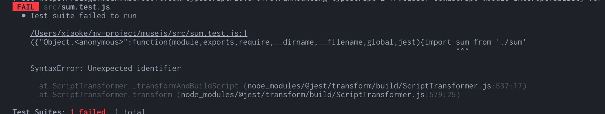

# 从头到尾创建一个函数库

这里记录从从头到尾搭建一个函数库的过程。

## 起项目

1. 创建文件夹

```bat
~ mkdir musejs
~ cd musejs
~ git init
~ npm init
```

2. 选择构建工具

这里选择 [webpack](https://webpack.js.org/) 作为项目构建工具。实际以这个例子来说，[rollup](https://rollupjs.org/guide/en/) 是比 webpack 简单的工具。但是由于我的私心(对 webpack 不是很熟，权当熟悉)，选择了 webpack。

(1) 首先，创建一个 `src` 文件夹，并添加入口文件 `index.ts`;

(2) 根据[官网](https://webpack.js.org/guides/getting-started/)的介绍，进行安装：

```bat
npm install webpack --save-dev
npm install webpack-cli --save-dev
```

(3) 由于我会自定义编译配置，因此在根目录下创建一个 `webpack.config.js` 文件，内容如下:

```js
// webpack.config.js
const path = require('path')

module.exports = {
  mode: 'none', // 不需要 care 开发模式
  entry: './src/index.ts',  // 修改入口文件
  output: {
    filename: 'main.js',
    path: path.resolve(__dirname, 'dist')
  }
}
```

(4) 修改 `package.json` 文件：

```json
{
  ...
  "main": "/dist/main.js",  // 修改 publish 入口文件，相对位置设置
  "scripts": {
    "test": "echo \"Error: no test specified\" && exit 1",
    "build": "webpack"  // 添加 build 指令
  },
  ...
  "devDependencies": {
    "webpack": "^4.39.3",
    "webpack-cli": "^3.3.7"
  }
}
```

(5) 添加 `.gitignore` 文件。如果你使用的是 [VSCode](https://code.visualstudio.com/)，推荐 [Gi](https://marketplace.visualstudio.com/items?itemName=rubbersheep.gi) 这个 extension。

3. 用 Babel 转译代码

对于 [Babel](https://babeljs.io/) 集成 webpack 的方式，可以参考 [babel#setup#webpack](https://babeljs.io/setup#webpack) 和 [babel-loader](https://webpack.js.org/loaders/babel-loader/#root) 两个页面。

第一步，安装核心依赖。

```bat
~ npm install -D babel-loader @babel/core @babel/preset-env
```

其中 [@babel/preset-env](https://babeljs.io/docs/en/babel-preset-env) 是标准 ES 代码转译为 ES5 代码的核心依赖，目前可能暂时只用到这个 preset。

第二步，配置 loader。

```js
// webpack.config.js
...
  module: {
    rules: [
      {
        test: /\.js$/,
        exclude: /node_modules/,
        loader: "babel-loader",
        // options: {
        //   presets: ['@babel/preset-env']
        // }
      }
    ]
  }
...
```

对于我而言，我并不喜欢将 babel 的配置项放到 webpack 或者 package.json 中(所以上面我注释掉了这段代码)。相反，我喜欢使用 `.babelrc` 文件。

第三步，新建 `.babelrc` 文件，配置 preset。

```js
{
  "presets": ["@babel/preset-env"]
}
```

4. 使用 TypeScript

对于一个库而言，更为严格的 [TypeScript](http://www.typescriptlang.org/) 必然是首选。TypeScript 集成 webpack, 可参考 [TypeScript](https://webpack.js.org/guides/typescript/#root) 这个配置。

传统的配置方式，需要按照 `ts-loader`。但是由于 TypeScript [拥抱 babel](https://iamturns.com/typescript-babel/)(官方 blog 可以参考[这里 ](https://devblogs.microsoft.com/typescript/typescript-and-babel-7/))，似乎不需要格外繁琐的配置了。

参考 [TypeScript-Babel-Starter](https://github.com/Microsoft/TypeScript-Babel-Starter) 的配置。

(1) 安装 TypeScript

```bat
~ npm install -D typescript
```

(2) 安装对应的 TypeScript 需要的 Babel preset 和 plugins

```bat
~ npm install -D @babel/preset-typescript @babel/plugin-proposal-class-properties @babel/plugin-proposal-object-rest-spread @babel/preset-env @babel/plugin-proposal-numeric-separator
```

(3) 配置 `.babelrc`

```json
// .babelrc
{
  "presets": ["@babel/preset-env", "@babel/typescript"],
  "plugins": ["@babel/proposal-class-properties", "@babel/proposal-object-rest-spread"]
}
```

(4) 添加 `tsconfig.json`

```json
{
  "compilerOptions": {
    "outDir": "./dist/",
    "noImplicitAny": true,
    "module": "es6",
    "target": "esnext", // 注意这里
    "jsx": "react",
    "declaration": true,
    "moduleResolution": "node"
    // "allowJs": false, // 最好的是，我们不需要编译 .js 文件，是的这交给 babel 来做
  },
  "include": [
    "./src/"
  ]
}
```

由于 TypeScript 也有相对 Babel 不是很灵活的 ES5 转译方式，为了避免重复操作，`target` 定义为 `esnext` 模式。

留意的是我们将 `declaration` 设置为 true, 来生成 `.d.ts` 文件。

(5) 配置 webpack

```js
// webpack.config.js
...
  resolve: {
    extensions: ['.ts', '.tsx', '.js', '.json']
  },
  module: {
    rules: [{
      test: /\.(ts|js)x?$/,
      exclude: /node_modules/,
      loader: 'babel-loader',
    }],
  }
...
```

注意 `resolve` 配置项，由于 `babel` 默认值查找 `.js` 文件，所以需要添加 `.ts` 等文件的支持。

至此为止，我们似乎省去了配置 `ts-loader` 的烦恼。可是，当你运行 webpack 时，你会发现 `babel loader` 为啥 **没有对 `.ts` 进行类型检查**。接下来我们要来补全这一行为。

(6) [fork-ts-checker-webpack-plugin](https://www.npmjs.com/package/fork-ts-checker-webpack-plugin)

为了解决这个问题，会使用到 [fork-ts-checker-webpack-plugin](https://www.npmjs.com/package/fork-ts-checker-webpack-plugin) 这个 webpack plugin。

```bat
~ npm install -D fork-ts-checker-webpack-plugin
```

接着配置 `webpack.config.js` 如下：

```js
const ForkTsCheckerWebpackPlugin = require('fork-ts-checker-webpack-plugin')
...

  plugins: [
    new ForkTsCheckerWebpackPlugin()
  ]
...
```

:::info
值得高兴的是 TypeScript 拥抱 babel 以减少繁琐的配置。但必须看到其[缺点](https://kulshekhar.github.io/ts-jest/user/babel7-or-ts)，尤其是无法提供 type checking([why]())。
:::

5. Lint

毫无疑问，我们会优先选择 [ESLint](https://eslint.org/)作为我们 [TypeScript 代码的 Lint 工具](https://eslint.org/blog/2019/01/future-typescript-eslint#the-future-of-typescript-on-eslint)。

(1) 安装依赖

```bat
~ npm install -D eslint eslint-loader @typescript-eslint/parser @typescript-eslint/eslint-plugin
```

+ `@typescript-eslint/parser` - eslint 用来 lint typescript 代码
+ `@typescript-eslint/eslint-plugin` - 专用于 typescript 的一个语法规则

(2) 新建 `.eslintrc` 配置文件

[参考 @typescript-eslint/eslint-plugin](https://www.npmjs.com/package/@typescript-eslint/eslint-plugin)

```json
// .eslintrc
{
  "parser": "@typescript-eslint/parser",
  "plugins": ["@typescript-eslint"],
  "rules": {
  },
  "extends": [
    "eslint:recommended",
    "plugin:@typescript-eslint/eslint-recommended",
    "plugin:@typescript-eslint/recommended"
  ]
}
```

(3) 配置 fork-ts-checker-webpack-plugin

如果我们要使用 fork-ts-checker-webpack-plugin 使用 eslint，需要在配置中开启 eslint 支持。

```js
// webpack.config.js
...
  plugins: [
    new ForkTsCheckerWebpackPlugin({
      eslint: true
    })
  ]
...
```

(4) Standard 规范

我是 [Standard](https://standardjs.com/readme-zhcn.html) 代码规范的支持者，因此会在项目中提供 Standard 规范支持。

```bat
~ npm install -D standard
```

并修改 `.eslintrc` 文件。

```js
// .eslintrc
{
...
  "extends": [
    ...
    standard
    ...
  ]
```

(5) 忽略某些文件 Lint

新建一个 `.eslintignore` 文件：

```text
// .eslintignore
dist/*
node_modules/*
```

(6) 将 eslint 添加到 webpack.config.js

```js
// webpack.config.js
...
  module: {
    rules: [
      {
        enforce: 'pre',
        test: /\.(ts|js)x?$/,
        exclude: /node_modules/,
        include: /src/,
        loader: 'eslint-loader'
      },
      {
        test: /\.(ts|js)x?$/,
        exclude: /node_modules/,
        loader: 'babel-loader'
      }
    ]
  },
...
```

6. Unit Test

单元测试工具选择 [Jest](https://jestjs.io/en/)，是因为其对 TypeScript 相对友好。

(1) 安装 Jest 和 ts-jest

Jest 可以配合 Babel, 由于 [babel-jest](https://www.npmjs.com/package/babel-jest) [无法在编译时 type check 测试文件](https://jestjs.io/docs/en/getting-started#using-typescript)(是的，上面提到的原因)，因此选择的是 [ts-jest](https://github.com/kulshekhar/ts-jest)。

```bat
npm i jest @types/jest ts-jest -D
```

(2) 新建 jest 配置项

仍然习惯新建一个文件来管理配置，所以新建 `jest.config.js` 文件，如下：

```js
module.exports = {
  roots: [
    '<rootDir>/src'
  ],
  transform: {
    '^.+\\.[t|j]sx?$': 'ts-jest'
  }
}
```

(3) 新建 `__test__` 文件

对测试文件进行统一归类是一个好的习惯，因此在 `src` 文件夹下新建一个 `__test__` 用于存放测试文件，并且测试文件需要命名为 `.test.` 的方式。由于我们使用的 `ts-jest`，因此文件以 `.test.ts` 结尾(否则会遇到附录中的问题)。

(4) 配置 npm script 指令

```json
...
  "scripts": {
    "test": "jest"
  }
...
```

接下来愉快地写测试代码吧。

7. 为 package.json 添加 typings

为了生成 `.d.ts` 文件，设置 `tsconfig.js` 的 `declaration: true`。但同时希望忽略 `__test__` 文件夹中的文件，因此添加配置 `exclude`：

```js
...
  "exclude": [
    "./src/__test__/"
  ]
...
```

添加 `src` 文件夹下的 `index.ts` 如下：

```ts
export { default as sum } from './sum'
```

运行指令 `tsc --emitDeclarationOnly` (这个指令添加为 npm script "build:types")，会在 `dist` 文件中生成 `index.d.ts` 文件。将其添加到 `package.json`。

```json
{
  ...
  "typings": "dist/index.d.ts"
  ...
}
```

## 发布到 Npm

发布到 Npm 只需要一条指令：

```bat
npm run publish
```

但是在此之前，通过 `npm adduser` 或 `npm login` 来添加发布者的信息。

:::info
发布前，现在 npm 上搜索是否有同名的库，不然可是发不上去哦。
:::


## 附录 - 遇到的问题汇总

1. Cannot find module '@babel/types'. TS2307

由于项目不使用 tsc 进行转译，所以 `tsconfig.js` 文件中设置 `modules: "es6"`。但由于 ts 编译器默认使用 *classic* 模块解析，因此如法解析非相对 `imports`。 [参考](https://github.com/babel/babel/issues/10237)

2. ({"Object.<anonymous>":function(module,exports,require,__dirname,__filename,global,jest){import sum from './sum'

如下图：

原因是使用了 `ts-jest`，但测试文件以 `.js` 结尾，换成 `.ts` 即可。

3. [warn] message TS151001: If you have issues related to imports, you should consider setting `esModuleInterop` to `true` in your TypeScript configuration file (usually `tsconfig.json`)

这是一个警告，内容参考 [Easier ECMAScript module interoperability](https://devblogs.microsoft.com/typescript/announcing-typescript-2-7/#easier-ecmascript-module-interoperability)。这是由于 ts 的模块策略和 webpack/babel 等不一致。最后一句：

> Webpack users may want to use this as well; however, your code should target esnext modules with a moduleResolution strategy of node. Using esnext modules with --esModuleInterop really only has the effect of turning on --allowSyntheticDefaultImports.

因此在 `tsconfig.js` 文件中，我们添加一行配置：

```ts
// tsconfig.js
...
  "compilerOptions": {
    ...
    "allowSyntheticDefaultImports": true
    ...
  },
...
```